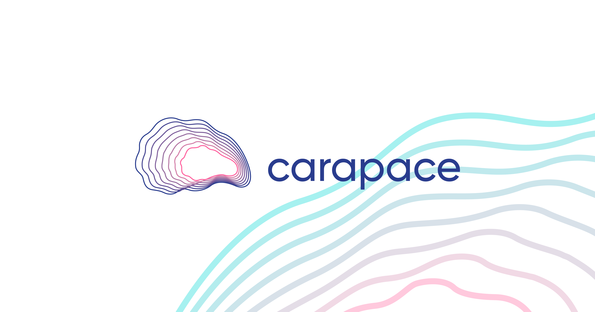

import styles from "../blog.module.css";

Our protocol will create a market that provides protection against default risk for under-collateralized DeFi loans and will pilot with Goldfinch, a leading crypto credit protocol

In early 2022, we set out to build a protocol to help solve one of the largest pain points for lenders in DeFi — lack of protection against credit risk. Since then, the team has been hard at work to develop this idea into a real product. Today we are pleased to announce our pre-seed round and waitlist for the test version of our product.

## The Problem: Current Lack of Protection for Lenders of under-collateralized Loans

Cryptocurrency lenders today face risk of borrower default while funding under-collateralized DeFi loans. As the DeFi lending market continues to grow, several primitives will need to be built to support the growth of under-collateralized loans. Carapace is building one such core DeFi primitive to make the industry more mature, more capital efficient, and to increase access amongst a diversified range of investors.

“Crypto loans are growing at an incredible pace, from a nominal amount to more than $25B last year, and will only continue to explode,” explained Morgan Beller, General Partner at NFX who led the $2.5m pre-seed round. “With very little protection for lenders of under-collateralized loans, Carapace’s protocol will provide a key piece of infrastructure that DeFi will need to grow.”

## Carapace’s Solution: Making DeFi Lending Safer

Carapace’s protocol solves this by permitting lenders on DeFi lending markets to purchase protection against default in order to hedge their default risk. Carapace will allow sellers — investors seeking yield who believe that the underlying loans are safe — to provide such default protection. Pricing of risk fluctuates with supply and demand in a system where protection sellers provide capital for risk protection in exchange for a premium. If a default event occurs, a payout is made to protection buyers.

## Early Supporters

We are backed by some of the best investors and entrepreneurs in the industry. NFX led the $2.5m pre-seed round which also saw participation from Tribe Capital, Ledger Prime, GSR Ventures, Synthetix, Titan Capital and 30+ firms and investors.

Carapace’s first pool will be built on the leading credit protocol, Goldfinch, and will initially be closed to users in the United States and certain other jurisdictions. Carapace has partnered with the Goldfinch team for its initial launch. “I first heard about Carapace about a year back after meeting Tai at a hackathon. I believe the project has great potential and will be really useful for the Goldfinch community” stated Blake West, Co-Founder of Goldfinch.

The current bear market for crypto has forced participants to be more aware of the return-risk tradeoff on their investments and we believe that we can help investors understand and mitigate credit risk on their DeFi loans.

Tai and I met through the South Park Commons programme, which is a community of builders based in San Francisco. While all interactions remained remote due to COVID, we both really enjoyed our conversations together despite coming from different backgrounds. While Tai is a crypto-native who has built various DeFi projects including Asia’s first mobile DeFi wallet, I come from a TradFi background with stints in ANZ Bank and Uber’s Fintech team.

Sign up for our beta below!

[Click here](https://xzpl2jauxb6.typeform.com/to/hSmuyZph?typeform-source=www.carapace.finance).
