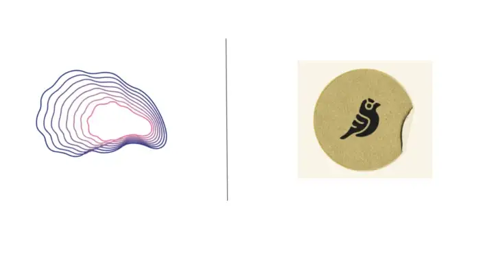

import styles from "../blog.module.css";

They say it takes a village to raise a child — the same applies to getting a startup business off the ground — and a DeFi protocol like ours is no different. At its earliest stages, a DeFi protocol benefits from its network of advisors, investors and _partners_. We at Carapace are fortunate to find one such awesome _partner_ in [Goldfinch](https://goldfinch.finance), with whom we’ll launch our first pool in Q1 2023.

The phenomenal team at Goldfinch is building one of the most interesting protocols in DeFi by helping bridge real-world assets with crypto lending. Backed by a16z, Goldfinch currently has ~100m USDC in outstanding loans.

## How it all started

My co-founder Tai met Blake West (Co-Founder, Goldfinch) at a hackathon in Autumn 2020. Tai shared his vision for building a protection market for under-collateralized loans. Blake loved the idea and continued to be in touch with the Carapace team throughout the build

Blake and the wider Goldfinch team has been extremely generous with their time and have gone to many lengths to help answer our queries. Access to the Goldfinch team was instrumental in helping us understand the Goldfinch protocol in-depth. And it was an easy decision to kick-off our product launch by first building on the Goldfinch protocol.

## Initial Pool Launch

Carapace’s first protection pool will be launched in Q1 2023 by combining 10 Goldfinch pools which currently yield between 17–20% for junior Goldfinch backers — full list will be released soon.

We selected these loans in order to maximize diversification (thus, minimizing contagion risk) across a range of factors including, but not limited to:

- Borrower Type
- Borrower strategy
- Geographical location of where the funds are being applied
- Industry where the funds are being applied

…and more

After our launch with Goldfinch in Q1 next year, we’ll look to partner with more protocols in the space as long as they meet our security requirements.

For now, we are focused on building for the Goldfinch eco-system and excited about the traction and response we are receiving from the Goldfinch (and wider DeFi community).

Sign up for our beta below!

[Click here](https://xzpl2jauxb6.typeform.com/to/hSmuyZph?typeform-source=www.carapace.finance).
