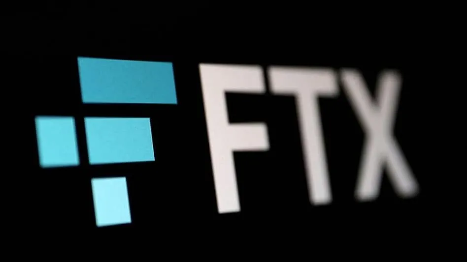

import styles from "../blog.module.css";

 

In this article, we cover how the recent FTX fallout impacted DeFi lending. More specifically, we call out some of the risks that came to light post-FTX while also providing some ideas/solutions on how these risks can be mitigated in the future. We remain very optimistic about the DeFi lending landscape — it’s time for us to come together and buidl!

 

### Issue 1: Contagion Risk

Carapace’s offering for protection sellers includes a diversified pool of loans/loan baskets in order to minimize contagion risk. But is that really possible in times of extreme cycles / black swan events? Some illustrative examples to consider -

    <li><strong>Crypto:</strong> Despite being a centralized exchange, the FTX fallout had several implications as several DeFi investors (both institutional and retail) had kept funds on FTX — unsurprising given that FTX was the 3rd or 4th largest centralized exchange in the world. There have been defaults in excess of $40m already and there might still be more coming.</li>
    <li><strong>Real-World:</strong> The world today is globalized and many countries’ economies are deeply interconnected. Protocols like Goldfinch and Credix focus on real-world risk where loans primarily end up in emerging markets. However since a majority of these loans need to be repaid in USDC (stablecoin pegged to the USD), these loans carry currency exchange risk and small changes in local currencies can have a major impact on the repayment amount.</li>

#### Potential Solutions

    <li>Build systems to ensure we are capturing borrower-level borrowing data across the protocols. The same could/should be done at a currency/country/industry level.</li>
    <li>Assuming we are able to build this sort of system over time, Carapace will aim to ensure that no one protocol/currency/country etc. makes up more than X % of the risk in a given pool</li>
    <li>Hedging solutions that can help mitigate currency risk across the board</li>

 

### Issue 2: Reliance on Delegate / Lead Backer model

*Criticism includes Mismanagement of Funds + Lack of Skin in the game*

Several protocols work off a model where one of the parties — typically a sophisticated credit investor — assesses the quality of the loans and is considered to be the lead party conducting due diligence. In return, they receive economic benefits and also stand to lose if the loans end up defaulting

In the Maple example, one of the delegates, Maven 11 allowed Orthogonal Trading’s loan to make up 80% of their pool in Dec 2022 (from 14% in Sep 2022). This happened because other borrowers returned funds to the pool which were being withdrawn by lenders. However, this sort of scenario which concentrates this amount of risk on one borrower should have been avoided. One of the criticisms from the incident has been that the stakes aren’t high enough for lending pool managers like M11 which will end up losing <500k on default of over $30m for this incident.

#### Potential Solutions

    <li>Compile data standards around borrower-level data that we will need to collect — especially for one being added to the Carapace pool.</li>
    <li>Include information on backer/loan manager/delegate and specifically the incentives/fee schedule on offer to them. Especially important to get clarity from credit protocols on what happens in the event of default. While the Carapace core team will not take a view on what is good or bad, we should aim to be transparent and capture + pass on this information for our protection sellers.</li>
    <li>Push more borrowers to undertake pool covenants as done by Cauris <a href='https://app.goldfinch.finance/pools/0x538473c3a69da2b305cf11a40cf2f3904de8db5f' target='_blank'>here</a></li>

 

### Issue 3: Re-hypothecation Risk

[Sherlock](https://www.sherlock.xyz/) lost >$4m in their ~$10m staking pool as they had invested a large proportion of funds in Maple’s Maven 11 pool. As seen in the case of Sherlock, investment management is a hard job — and a very specialized one too. While Sherlock did communicate to their users about investing in Maple, there was limited information on how this investment would occur, and in which pools. In addition, stakers did not have any control over how these funds were invested so they were only able to make a decision on whether to stake or not stake their funds in the Sherlock pool. Due to not raising the expected amount of capital for their pool, Sherlock ended up in a scenario where funds were invested across 2 protocols despite earlier intentions to invest in 4 protocols.

#### Potential Solutions

    <li>Re-hypothecation strategies should be geared around choice for the users to make decisions on where their capital is being invested. Where possible, best to get professionals to manage these pools. Early indications suggest that Sherlock will adopt some of these practices going forward.</li>
    <li>Communication is key when it comes to clarifying the risk involved in re-investing customers’ assets.</li>

 

### Issue 4: Borrowers lying/misrepresenting facts

As alleged by Maple and Maven11, Orthogonal Trading lied about not being impacted by FTX. In fact, Orthogonal Trading did not provide any indication that they would default on their loan until one of their repayment dates on Sunday 4th Dec. There are additional allegations that Orthogonal might have lost more money in riskier trades in an attempt to recover the lost funds (Note: this claim has not been verified).

However, the key concern coming out of this incident is that borrowers can lie/make up data and it is unclear whether this will lead to any legal action against Orthogonal. Maven 11 has stated on Twitter that Orthogonal has breached the contract but it is not clear whether Orthogonal will face penalties as a result of the incident.

#### Potential Solutions

    <li>Standardization of the liquidation process (if collateral exists)</li>
    <li>Clear litigation frameworks to tackle such scenarios</li>
    <li>Ability to access as much on-chain collateral data as possible.</li>

 

### Issue 5: Borrowers borrowing from multiple protocols

As seen from the example of Auros, they ended up borrowing on Clearpool as well as Maple. For both protocols, they ended up requiring extensions in December from both protocols to return their loan. There was no requirement for Auros to be transparent about their borrowings across protocols and lenders. Thus, one protocol might never become aware of an entity’s borrowings from another protocol

#### Potential Solutions

    <li>Building tools that capture a borrower’s credit activity across multiple protocols and ensure that no one borrower makes up a significant concentration within a pool or even the protocol as a whole)</li>
    <li>Communication channels between various protocols to ensure there is transparency across the board regarding an entity’s borrowing activities</li>

 

 

 

As you can see from some of the examples above, under-collateralized lending is still in its building phase and the industry will need to build these solutions (and more) to tackle some of the challenges in the space.

That’s the only way we’ll see DeFi lending and borrowing go mainstream. We are Carapace remain very bullish on this space and are building protection against default risk for under-collateralized loans. You can visit us at https://www.carapace.finance to learn more!
