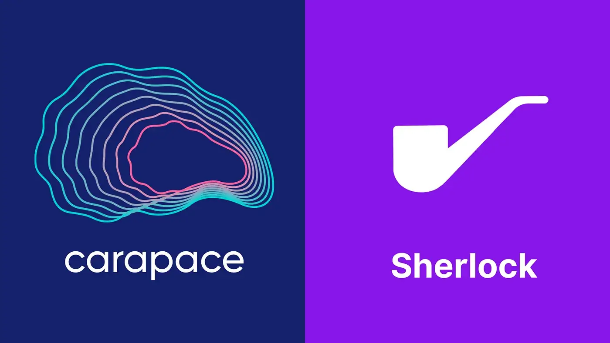

import styles from "../blog.module.css";

 

Carapace Protocol will be working with [Sherlock](https://sherlock.xyz/) to make our contracts secure and to protect our users from capital loss due to smart contract hacking.

Sherlock has a unique approach to auditing where they combine the best of the legacy audit model (designated senior security expert on each project) with an audit contest model (50+ independent auditors competing head-to-head). On top of that, Sherlock offers protection to audited contracts. Carapace Protocol will be protected up to $5M in the 1st version.

We appreciate Sherlock’s method because they maintain skin in the game; they are strongly motivated to thoroughly audit our smart contracts because they will be required to make a payment if there is a hack of the smart contract

Sherlock determines if a certain smart contract hacking event is eligible for a claim based on the public-facing coverage agreement with each protocol. You can find examples [here](https://github.com/sherlock-protocol/sherlock-reports/tree/main/coverage-agreements). The Carapace coverage agreement will be available at the very end of the auditing process, and it won’t be too dissimilar from the example agreements above.

Carapace takes smart contract security seriously, and we are glad to work with Sherlock.