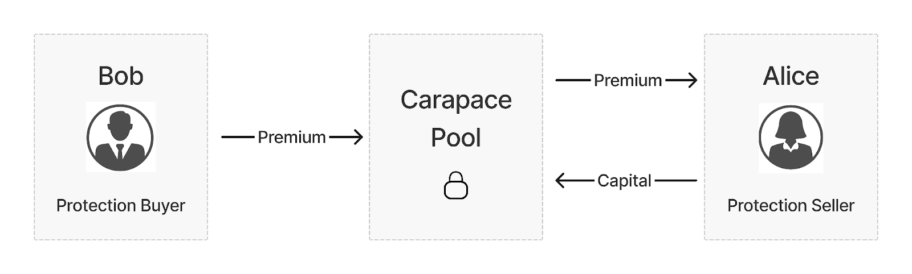

import styles from "./docs.module.css";

# Overview

Carapace connects buyers and sellers of protection against default risk for under-collateralized loans in DeFi.

## Protection Buyers

Lenders/Liquidity Providers (LPs) of under-collateralized lending protocols like Goldfinch who can buy protection against borrower default by paying a premium into Carapace’s Protection Pool.

## Protection Sellers

Sellers of protection risk can earn premiums by locking in capital within the Protection Pool. They take on exposure to cover default risk in a basket of underlying lending pools on protocols like Goldfinch.

## Why we are building Carapace

Under-collateralized lending in DeFi unlocks multiple use-cases in helping fund both crypto as well as real world assets. For DeFi lending to become a huge market, several primitives will need to be built. At Carapace, we are building one such core DeFi primitive to make the industry more mature, more capital efficient, and to increase access amongst a diversified range of investors.
