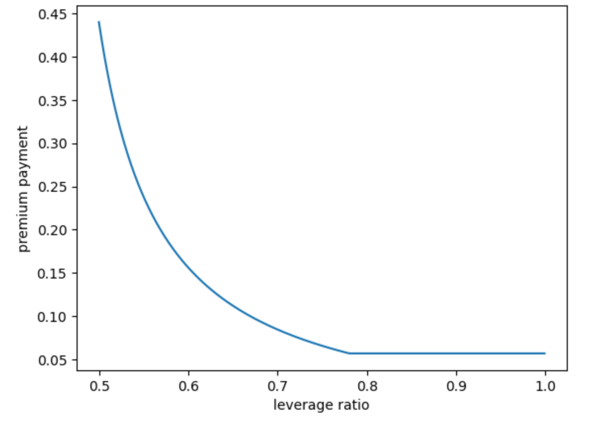

import styles from "../docs.module.css";

## Pool Structure

### Diversification

While the initial Carapace pool will consist of ten lending pools on the Goldfinch protocol, over a period of time we will aggregate lending pools across multiple other protocols. As a result, our pools will be diversified across factors such as geography, asset class, borrower type, on chain vs. Real World Asset (RWA), protocols, etc. This diversification reduces the risk for our protection sellers with regards to default in underlying lending pools.

### Leveraged Pools

Our pools are leveraged. What this means is that if a protection seller wants to protect $100 worth of lending pools, she does not need to deposit $100 of liquidity into the pool. The % of investment required in this instance will be a lower number (50% min. for the initial pool) as we do not expect each lending pool in the Carapace pool to default at the same time. 

As a result of this phenomenon, protection sellers can access leveraged yields. For example, a protection buyer pays $10 premium to protect $100 of loans so his premium paid% is 10%. If leverage ratio is 50% and a protection seller is only required to lock in $50 of protection capital, then the protection seller’s yield will be 20% ($10/$50). 

Please note that higher leverage also increases the risk for protection sellers as their capital loss percentage will be higher in case of default.  For example, a protection seller might face 10% loss in a given Carapace pool but face >10% loss of their capital depending on leverage ratio. Hence with higher rewards, we also have higher risk. 

#### Leverage Ratio

The relationship between protection purchased (demand) and protection sold (supply) is known as the leverage ratio. See more details on leverage ratio in our White Paper [here](/WhitePaper/#premium-pricing).

#### Leverage Ratio Range

Each pool will have a ceiling and floor in a way that leverage ratio is maintained within an acceptable range. We select these variables to ensure that Carapace Pool has sufficient liquidity to cover losses in the event of default. Equally importantly, we want to ensure that protection sellers earn a certain minimum level yield from premiums in the Carapace Pool that reflects the degree of risk being taken.

#### Addition of New Lending Pools

After the initial setup of a Carapace pool, each subsequent expiration of a lending pool within a Carapace pool will result in Carapace adding an additional lending pool to the Carapace pool. The ideal scenario is that the new underlying lending pool matches the characteristics of the expiring lending pool to the extent possible in terms of duration, level and type of risk, borrower profile etc.

 

## Premium Pricing
### Key Factors

Premium paid by a protection buyer is calculated primarily based on:

<ul className={styles.bulletpoints}>
  <li>Existing capital (supply) and existing protection (demand) in the pool</li>
  <li>Duration of protection required by protection buyers</li>
  <li>protection amount demanded by protection buyers</li>
  <li>% of expected yield of protection buyer from underlying protocol’s lending pool</li>
</ul>

Directionally speaking,

<ul className={styles.bulletpoints}>
  <li>If a pool has a high amount of existing liquidity, then premium will be lower</li>
  <li>If duration of protection demanded is longer, then premium will be higher</li>
  <li>If amount of protection being bought is higher, then premium will be higher</li>
  <li>If expected yield from underlying lending pool is higher, then premium will be higher</li>
</ul>

### Premium Curve

As an illustrative example, see premium yield curve based on Carapace’s initial protection pool. Assuming that a protection buyer’s APY with Goldfinch is 17%, we can see how premium pricing moves with changes in the leverage ratio.

## Default Payouts

As soon as a borrower fails to repay on the expected date as per the repayment schedule, Carapace considers the respective underlying lending pool to be in a ‘potential default state’. If a lending pool in a ‘potential default state’ does NOT receive two repayments in the next two repayment periods, the lending pool is considered to be in default by the Carapace protocol. Therafter, buyers will be eligible to claim a default payout.

### Sufficient Capital for Payouts

Carapace aims to ensure appropriate capital is locked in a Carapace Pool to cover any potential defaults. In case the capital locked in the pool is insufficient to cover default related payouts, then Carapace Pool can access:
<ul className={styles.bulletpoints}>
  <li>Treasury reserve - Portion of the revenue earned by Carapace Pool will be set aside for a reserve fund </li>
  <li>CARA Tokens - As a last resort, a portion of the tokens could be leveraged by the community to cover any losses that are not covered by locked capital and treasury reserve</li>
</ul>

### Borrower Repayments Post-Default

It is possible that borrowers are unable to make repayments on the due date, but are able to return funds to lenders at a later time. To support such cases, protection buyers that are making a payout claim will be required to lock up their underlying protocol’s LP tokens in the Carapace Pool. As a result, protection buyers will end up transferring ownership of LP tokens to Carapace, held on behalf of its protection sellers. 

In this way, protection sellers can access repayments (if any) post default event by redeeming tokens of the respective lending protocol.
