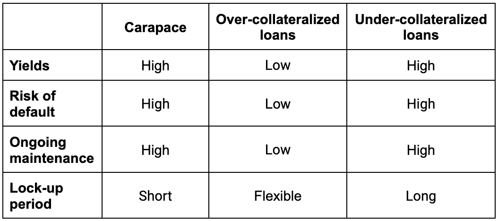

import styles from "../docs.module.css";

 

Selling protection on Carapace means taking on exposure to cover default risk in a basket of under-collateralized DeFi lending pools. In return, investors can earn high yields, primarily via premiums paid by protection buyers.

## Key Benefits

For protection sellers, Carapace offers a well-diversified portfolio, providing exposure to lending pools in some of the best under-collateralized lending protocols. Benefits include - 

### Flexible terms

Carapace operates on the basis of cycles and each cycle is 90 days. Sellers have the ability to withdraw capital within two cycles i.e. within 180 days for those looking for shorter-term investment horizons. It also brings uniformity to their investment, in terms of capital horizon, as underlying lending pools might have varying maturity dates (e.g. Loan A expires on Jan 1st 2024, Loan B expires on Mar 1st 2024 etc.) but sellers’ funds are only locked up for up to a period of 2 cycles (180 days) after a deposit has been made.

### Diversification

Find more details in [Protocol Mechanics: General](https://www.carapace.finance/docs/protocol-mechanics/general).

### Leveraged yields from premium payments

Find more details in [Protocol Mechanics: General](https://www.carapace.finance/docs/protocol-mechanics/general).

### Access

Carapace enables access to a market where a seller can access yields on lending pools that have already closed or lending pools with illiquid bond markets.

## Deposit

Sellers can make a deposit at any time but will only accrue premium from the date of deposit up to the date of next payment term in the underlying lending pool. With this design, we prevent sellers from earning interest without being exposed to default risk.

### Conditions for Deposit

A seller can make a deposit at any time as long as the follow conditions are met:
<ul className={styles.bulletpoints}>
  <li>If the total capital in the pool is less than the minimum capital in a pool OR</li>
  <li>If the leverage ratio is less than the leverage ratio ceiling after the transaction</li>
</ul>

## Withdrawal

Sellers can make a withdrawal request at any time by specifying the sToken amount that they wish to withdraw. As explained in our [White Paper](https://www.carapace.finance/WhitePaper/#premium-pricing), sToken amount equals funds deposited plus accrued premiums minus default payouts for a given seller.

In addition, protection sellers will always have the ability to sell sTokens in the secondary market as long as there is a buyer.

### Request for Withdrawal 

A withdrawal request gives the seller the option but not the obligation to withdraw funds after the end of the next cycle during the open state. A request will be invalid after the open state regardless of whether the withdrawal was made or not. Otherwise, you can withdraw at the beginning of any cycle with no economic cost. If a seller wants to keep their capital in a pool, they don't have to make a request. 

Each seller must lock their capital for at least one cycle plus the remaining days in the current cycle from the point where a request is made. Since the cycle duration is 90 days, if you deposit on day 80 and immediately request to withdraw, you need to lock up for 10 days plus another 90 days. This system prevents sellers from running away when a default event happens. 

If a seller makes a request and transfers her sTokens to another address, the new address needs to make another withdrawal request.

### Conditions for Withdrawal

A seller can make withdraw as long as the following conditions are met:
<ul className={styles.bulletpoints}>
  <li>A withdrawal request is made in the n - 2 cycle AND</li>
  <li>Withdrawal amount is less than the requested amount AND</li>
  <li>Withdrawal takes place in the open state of a cycle</li>
</ul>

## Sources of Yield

### Premium Payments

Primary source of yield for sellers is by collecting premium payments made by buyers. This yield can vary based on several factors such as level of risk in underlying pools, duration of capital provided, amount of protection being bought etc. With sufficient premium and a reasonably low leverage ratio ceiling (see detailed explanation of leverage ratio in our White Paper), protection sellers will be able to earn high yields.

### Rehypothecation

We plan to use some capital in a protection pool to invest in yields earning sources in the upcoming versions. We will aim to give investors flexibility and transparency on how these funds are reinvested. The interest generated from the investment will be distributed to our protection sellers.

### CARA token rewards

Early protection sellers are rewarded with our protocol token. They can invest their CARA tokens in decentralized exchanges (DEXes) to earn more yields.

## Risks

### Default

The primary risk that protection sellers face is the probability of default caused due to non-repayment in the underlying lending pools that are being protected. When default occurs, protection sellers lose capital which has been locked in the Carapace pool. 

In practice, when default occurs, protection buyers are provided with an option on whether to receive a payout or not. If they choose to exercise their protection and receive payout, these funds will be taken from the Carapace Pool and protection sellers will end up losing this amount. In exchange, protection sellers will receive underlying LP tokens associated with the default payout. 

Note that payouts cannot exceed principal loss suffered by a particular protection buyer i.e. excludes interest payments and principal repaid up to date of default

### Other Risks

#### Smart contract exploit risk 

Note that Initial users are protected from smart contract exploit risk as a result of insurance purchased from Sherlock for up to $5m.

#### Rehypothecation risk

Potential loss of capital from Carapace partners’ yield generating strategies. Note that this feature will be launched in future versions of the protocol and sellers will be provided with the option on whether to participate in the program or not. 

#### Fraud on under-collateralized lending protocol 

To minimize fraud via under-collateralized lending protocols, we will only work with protocols like Goldfinch which are building secure incentive models (e.g. decentralized audit system) and strong security measures to minimize fraud. 

## Competitive Landscape

## Data availability for Due-Diligence

Carapace will provide the following info at the Carapace pool level:
<ul className={styles.bulletpoints}>
  <li>process used to structure the pool</li>
  <li>percentage of each lending pool represented within the Carapace pool</li>
  <li>ratio of seller capital to potential payouts</li>
  <li>maximum seller deposit amount allowed in the pool at a given point of time</li>
  <li>applicable premium to purchase protection at any given time</li>
  <li>minimum lock in period</li>
</ul>

Carapace will provide the following info at the under-collateralized lending pool level:
<ul className={styles.bulletpoints}>
  <li>Lending pool duration, payback period and underlying yield</li>
  <li>Borrower profile</li>
  <li>Borrower on-chain transaction history including any past defaults if applicable</li>
  <li>Industry and Geography where lending pool’s funds will be deployed</li>
  <li>Additional relevant information</li>
</ul>

## Risk Monitoring

Carapace protocol (or our partner) aims to include a dashboard where protection sellers can get access to real-time data tracking of all underlying lending pool transactions including repayments and defaults. 

