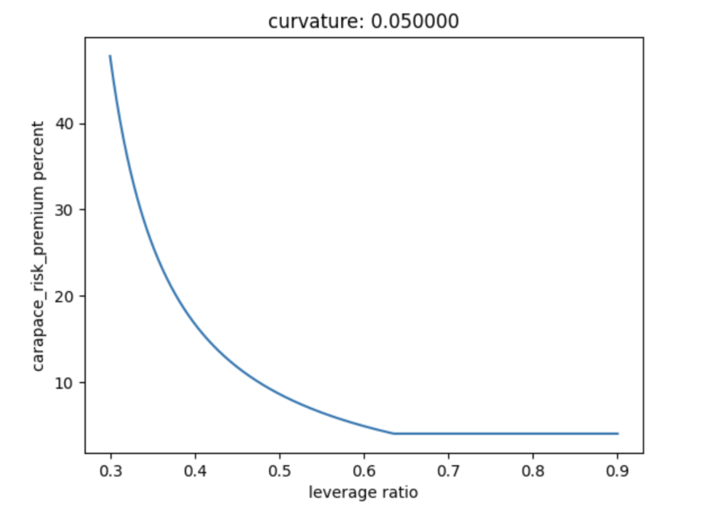

import styles from './white_paper.module.css'

Carapace Protocol

<h1 className={styles.whitePaperh1}>Decentralized Protection Against Credit Default Risk</h1>

Taisuke Mino

<h2 id="abstract" className={styles.whitePaperh2}>Abstract</h2>

This paper proposes decentralized protection against default risk in under-collateralized crypto loans. Traditionally, protection against credit default risk is known as credit default swaps.

We aim to build the next DeFi primitive currently missing in the market to make DeFi more resilient to credit risks. Credit risk protection is critical for the mass adoption of decentralized finance.

We create a market where traders can swap the default risk. Protection buyers pay a premium to get the right to claim protection when an underlying loan defaults. Protection sellers provide capital for protection in exchange for a premium. When a default event occurs, a payout is made to protection buyers.

Carapace protocol is a non-custodial automated market maker implemented on a blockchain. Our automated market maker (AMM) pools liquidity and makes it available to swap traders according to an algorithm such as our premium pricing formula that fluctuates with supply and demand and the exchange rate formula that keeps increasing with the interest accrual.

<h2 id="peer-to-peer" className={styles.whitePaperh2}>Peer-to-Pool Model</h2>

Each swap market is represented by a pool contract.

<h3 className={styles.whitePaperh3}>Pool Design</h3>

Each pool contract represents a bundle of lending pools in under-collateralized crypto loans. The under-collateralized crypto loans are provided by lending protocols such as Goldfinch, Maple Finance, TrueFi, to name a few. We aggregate lending pools to avoid market fragmentation and to achieve high liquidity.

<h3 className={styles.whitePaperh3}>Protection Buyers</h3>

If you want to hedge against the default risk of a specific underlying lending pool, you can pay some premium to a pool contract and get the right to claim a payout if the lending pool defaults.

<h3 className={styles.whitePaperh3}>Protection Sellers</h3>

If you are convinced that the underlying lending pools are safe, you can invest capital in the respective pool contract to earn yields. You will get a representative sToken in exchange for the capital you have invested.

If one of the lending pools defaults, some liquidity is kept aside for protection. If no loan defaults within the designated period, then protection sellers earn yield via premium payment, without facing any loss.

Our pool contract locks the capital provided for some time to prevent protection sellers from running away without providing protection when a lending pool defaults.

Sellers can always request to withdraw the deposited capital, or they can keep their capital in a pool to keep earning yields.

<h2 id="premium-pricing" className={styles.whitePaperh2}>Premium Pricing</h2>

*premium* = (*carapace_risk_premium* + *underlying_risk_premium*) \* *protection_amount*

<h3 className={styles.whitePaperh3}>Carapace Risk Premium</h3>

*carapace_risk_premium* 
= *max*((1 - (e \*\* (- *duration* \* *risk_factor*))), *MIN_CARAPACE_RISK_PREMIUM* )

e is the mathematical constant. We use the e because we assume survival of the protections in the protection pool follows the Poisson distribution.

*carapace_risk_premium* is priced based on three main factors: 
<ul>
<li className={styles.whitePaperli}>1. <i>duration</i> which is selected by protection buyers.</li>
<li className={styles.whitePaperli}>2. <i>risk_factor</i>, which represents how risky a given pool is. It simulates the hazard rate(survival rate or (1 - default rate)) in the Poisson distribution.</li>
<li className={styles.whitePaperli}>3. <i>MIN_CARAPACE_RISK_PREMIUM</i> is the minimum amount of carapace_risk_premium paid by a protection buyer.</li>
</ul>

We will explain them in more detail below.

<h3 className={styles.whitePaperh3}>Duration</h3>

*duration* is the expiration time minus the current time. All other things being equal, the premium is cheaper when the duration is shorter because it is less likely that a default event occurs when there is a shorter window of time for loans to default.

Since traders typically work with days remaining to expiration, we convert these to the percentage of the year. For example, for protection that expires in 10 days, the duration input is 10/365.24 = 0.0273 or 2.73%.

To sum up, we can express the duration with: 
*days_to_expiration* / 365.24

<h3 className={styles.whitePaperh3}>Risk Factor</h3>

The risk factor represents how the market thinks about the risk of a particular pool. The riskier the pool, the higher the risk factor and the more expensive a premium becomes. A risk factor of *1* means a pool is quite risky, while a risk factor of *0* means a pool is quite safe.

*risk_factor* 
= (((*LEVERAGE_RATIO_CEILING* + *BUFFER*) - *leverage_ratio*) 
     / (*leverage_ratio* - (*LEVERAGE_RATIO_FLOOR* - *BUFFER*))) 
    \* *CURVATURE*

The risk factor is calculated based on two main factors: 
<ul>
<li className={styles.whitePaperli}>1. <i>leverage_ratio</i> which fluctuates with changes in supply and demand in the market</li>
<li className={styles.whitePaperli}>2. <i>CURVATURE</i> which is determined  by the core team (and eventually by our community).</li>
</ul>

We will explain the two main factors below in detail.

<h3 className={styles.whitePaperh3}>Leverage Ratio</h3>

Here, we will be explaining the first part of the risk factor equation: 
 (((*LEVERAGE_RATIO_CEILING* + *BUFFER*) - *leverage_ratio*) 
 / (*leverage_ratio* - (*LEVERAGE_RATIO_FLOOR* - *BUFFER*)))

Our protection pool is leveraged; the pool doesn’t store capital for the total protection amount because it is unlikely that all the protected loans are going to default at the same time. The leverage ratio is calculated with the equation below.

*the leverage ratio* = *total_sToken_underlying / total_protection_amount* 
where 
*total_sToken_underlying* = *seller_deposit* + *accrued_premiums* - *default_payouts*

The higher the leverage ratio is, the lower the risk factor and the premium are because the market believes that underlying loans are safe. The lower the leverage ratio is, the higher the risk factor and the premium are because the market believes that underlying loans are unsafe. You can see the graph below where the premium price is plotted depending on the leverage ratio(this is for reference only).

When there is more demand, the *total_protection_amount* value increases more than the *accrued_premiums* value, which means the leverage ratio goes down. Thus, with the higher demand, the risk factor and the premium will be higher.

When there is more supply, the sToken underlying amount increases, which means the leverage ratio increases. Thus, with a higher supply, the risk factor and the premium will be lower.

As you can see, the premium price is effectively an aggregated view of supply and demand in the market. In other words, the premium price is the prediction of the market about default risk.

Lastly, we use the buffer value(e.g. 0.05) to avoid edge case inconsistency. For example, when the leverage ratio goes to the floor, without subtracting the buffer value, the premium curve steepens at a high pace and goes to 100%. The buffer values also ensure that the numerator or denominator won’t be zero.

<h3 className={styles.whitePaperh3}>Curvature</h3>

*CURVATURE* exists literally to adjust the curvature of the curve. If this doesn’t exist or if this is *1*, the shape would be linear. *0.01* is steeper than *0.05*.

<h3 className={styles.whitePaperh3}>Minimum Carapace Risk Premium</h3>

The MIN_CARAPACE_RISK_PREMIUM is the minimum carapace_risk_premium paid by a protection buyer regardless of the leverage ratio.

<h3 className={styles.whitePaperh3}>Underlying Risk Premium</h3>

The underlying_risk_premium represents the level of risk in an underlying lending pool within a given protection pool. The riskier the underlying lending pools are, the more expensive the underlying_risk_premium. We use the yield from underlying lending pools to indicate the level of risk; for lenders of unsecured lending protocols, higher yields indicate a higher risk of default.

*underlying_risk_premium* 
= *UNDERLYING_RISK_PREMIUM_PERCENT* \* duration \* *protection_buyer_apy*

*UNDERLYING_RISK_PREMIUM_PERCENT* is a constant value like 10% which represents the percentage of protection buyers yields we take into account.

*duration* is the expiration time minus the current time as we explained in the Carapace Risk Premium section.

*protection_buyer_apy* is expected yields for protection buyers in underlying loans in case of survival. The higher the protection_buyer_apy is, the higher the risk of underlying loans and the premium are.

<h3 className={styles.whitePaperh3}>Protection Amount</h3>

The amount of protection a buyer wants to get. *protection_amount* is selected by protection buyers. The more protection you want to get, the more premium you need to pay.

<h2 id="yields-distribution" className={styles.whitePaperh2}>Yields Distribution</h2>

Carapace Protocol distributes yields with a combination of 1) an sToken in each pool, 2) the exchange rate, and 3) the accrued premium.

<h3 className={styles.whitePaperh3}>sToken</h3>

sToken is an interest-bearing token that protection sellers get in exchange for an underlying token like USDC that they deposit. Each pool represents a different risk and has its sToken.

The sToken represents the capital provided plus interest from the premium (we will also source interest from rehypothecation in upcoming versions).

Protection sellers can return their sToken to redeem their deposited capital and interest once the lockup period has ended. The sToken will be burned when sellers withdraw their capital. Some capital and interest may be lost due to a default event.

If sellers wish to redeem their capital and interest before the lockup period, they might be able to find a buyer of their sToken in a secondary market like Uniswap. Traders in the exchanges can long/short sTokens based on their opinion about the risk exposure associated with sTokens. Since an sToken is a fungible ERC20 token, it is fairly easy to bootstrap the secondary markets for protection sellers.

<h3 className={styles.whitePaperh3}>The Exchange Rate</h3>

The exchange rate is the total sToken underlying token amount divided by the total supply of sTokens.

*the exchange rate = total_sToken_underlying / total_sTokens*

You can get the total underlying value of the total sToken by multiplying the total sTokens with the exchange rate. 
*total_sToken_underlying = total_sTokens \* the_exchange_rate* 
where *total_sToken_underlying* 
= *total_seller_deposit* + *total_accrued_premiums* - *total_default_payouts(if any)*

You can get your share of underlying tokens by multiplying your sToken share with the exchange rate.

Although an sToken amount stays constant, the token accumulates interest through the exchange rate; the exchange rate keeps increasing as a premium is paid by protection buyers. Thus, each sToken is exchangeable with an increasing amount of its underlying token. In other words, the interest for each sToken holder is the delta between the *sToken* \* the *exchange rate* when they exit the market and the *sToken* \* *the exchange rate* when they enter the market. The exchange rate decreases only when the capital is locked for potential default claim payouts.

Mathematically speaking, the exchange rate changes only when *total_accrued_premiums* or *total_default_payouts* change, which means only when there are premium accrual or default payouts. The exchange rate doesn’t change with the seller's deposit or withdrawal amount because the sTokens minted and sTokens burned will be proportional to the deposited or withdrawn amount. The protection purchase doesn’t also change the exchange rate at that block because there is no premium accrued for that protection yet.

One key property of the exchange rate is that the exchange rate from time A to B and B to C is the same as the exchange rate from A to C. If we calculate the exchange rate at time C from time A, we get the same exchange rate when we calculate the exchange rate at time B from time A and then calculate the exchange at time C from time B. In both ways, the exchange rate at C will be the same.

<h3 className={styles.whitePaperh3}>Accrued Premium</h3>

As we discussed above, 
*the exchange rate = total_sToken_underlying / total_sTokens*

where 
*total_sToken_underlying* 
= *total_seller_deposit + total_accrued_premiums - total_default_payouts(if any)*

The *total_seller_deposit* is self-explanatory. The *total_default_payouts* is the amount of capital locked for potential default claim payouts.

The biggest question is how we calculate the *total_accrued_premiums*. In short, the premium paid by a buyer will accrue for sellers over the duration of protection.

Accrued premium AP between any time t and T: 
AP = K \* ( $e^{- t * \lambda}$ - $e^{- T * \lambda}$ )

We will explain the premium accrual in more detail below. Accrued premium is priced based on three main factors: 
<ul>
<li className={styles.whitePaperli}>1. K is a constant amount that acts like a unit.</li>
<li className={styles.whitePaperli}>2. t is the beginning time and T is the end time of protection.</li>
<li className={styles.whitePaperli}>3. 𝜆 is the risk factor from the premium pricing formula for this protection divided by 365.</li>
</ul>

<h3 className={styles.whitePaperh3}>K</h3>

K = P / ( $e^{- t * \lambda}$ - $e^{- T * \lambda}$ )

where P is protection_premium $-$ *protocol_fees*.

Imagine that a protection buyer has bought 180 days protection for $10,000 and the protocol fee is $100. Then:

K = (10,000 - 100) / (1 - $e^{- 180 * \lambda}$ )

<h3 className={styles.whitePaperh3}>t and T</h3>

t is the beginning time and T is the end time of protection. In other words, duration is T - t. 
where: 0 < t < T

t and T can be seconds as long as they are expressed in years. This is because we use 365 in the risk factor below.

<h3 className={styles.whitePaperh3}>𝜆</h3>

𝜆 is the risk factor from the premium pricing formula for this protection divided by 365 (we use 365 regardless of the duration to get units in years). We assume risk follows Poisson distribution in line with premium pricing.

𝜆 
= risk_factor / 365 
= (((LEVERAGE_RATIO_CEILING + BUFFER) - leverage_ratio) 
/ (*leverage_ratio* - (*LEVERAGE_RATIO_FLOOR* - *BUFFER*))) 
\* *CURVATURE* / 365

<h3 className={styles.whitePaperh3}>Example</h3>

Imagine that a protection buyer has bought 180 days protection for $10,000 and the protocol fee is $100. The premium for the pool is paid on day 0, and the protection covers till day 180. How do we calculate the accrued premium after 180 days?

K = (10,000 - 100) / (1 - $e^{- 180 * \lambda}$ )

Accrued premium(AP) from day 0 to day 180 
= K \* ( $e^{- 0 * \lambda}$ \*  - $e^{- 180 * \lambda}$ ) 
= K \* ( 1 - $e^{- 180 * \lambda}$  )

We can also say that the accrued premium for day 0 + day 1 + day 2 + … + day 180 
= $\displaystyle\sum_{t=1}^{180}$ K \* ($e^{- (t-1) * \lambda}$ - $e^{- t * \lambda}$ )

<h3 className={styles.whitePaperh3}>Transitivity</h3>

The accrued premium has a transitive property. Accrued premium from time A to C = Accrued premium from time A to B + accrued premium from time B to C.

<h3 className={styles.whitePaperh3}>Fair Distribution</h3>

One of the most important principles of yield distribution is fairness. I will outline how we distribute yield fairly with the above distribution mechanism.

First, at the risk of stating the obvious, a protection seller is entitled to receive a premium from protection buyers only when they protect them. Thus, protection sellers get a premium only when their locking period overlaps with the protection duration of protection buyers. This is why we accrue a premium over the duration of protection following the poisson distribution. Second, when a seller withdraws, they get a proportional amount of premium depending on their share of total capital provided in a given block. Third, the longer they keep their capital in a pool, the more premium they can earn. They can earn more interest with the longer deposit term because the delta between the sToken * the exchange rate when they exit the market and the sToken * the exchange rate when they enter the market will be bigger.

<h2 id="payouts" className={styles.whitePaperh2}>Payouts</h2>

<h3 className={styles.whitePaperh3}>Premium</h3>

When a locking term ends, a protection seller can get a proportional amount of all the premiums in a pool depending on the amount of protection they have provided.

<h3 className={styles.whitePaperh3}>Protection</h3>

Protection buyers get protection depending on how much premium they have paid. They must show their proof of loss in the form of an LP token in underlying lending protocols. More specifically, they get protection in exchange for the LP token and can get only what they have lost.

<h2 id="security" className={styles.whitePaperh2}>Security</h2>

We take security seriously to maintain trust in our system.

In life insurance, a buyer might assassinate somebody and then attempt to collect money from the insurance carrier. By the same token, it is possible that a buyer of credit default swaps manipulates a default event for a profit.

We have a defense mechanism against this classic insurance problem. In short, we require Protection buyers to be a lender of an underlying loan through our proof of loss system.

<h3 className={styles.whitePaperh3}>Proof of Loss</h3>

More specifically, our proof of loss system requires Protection buyers to lock the LP tokens representing a loan amount in under-collateralized lending protocols. In this way, only a lender can be a protection buyer, and a protection buyer can get only what they have lost.

There are two possible attacks against this system where a protection buyer who is also a lender in an underlying loan manipulates a default event.

First, self-loan. Let's say Bob lends $10k to himself as an LP and borrows $100k in total. Bob pays a premium to Carapace to get $10k worth of protection. He maliciously defaults and runs away with $100k + $10k - premium. Second, collusion between a lender and a borrower. Bob(LP) lends $10k to Alice(borrower). Alice borrows $100k in total. Bob pays a premium to Carapace to get $10k worth of protection. Alice maliciously defaults. Bob and Alice run away with $100k - premium. Legit under-collateralized lending protocols have a security model against these attacks. Most importantly, borrowers are required to go through the KYC process. It goes without saying that Bob and Alice face significant reputation risk that damages their reputation widely and serious legal risk of getting arrested in both cases as long as there is an identity system. Some protocols, such as Goldfinch have another layer of protection where a randomly chosen auditor carefully chooses a borrower who is not involved in collusion.

Thus, it is critical to rigorously review each under-collateralized lending protocol and ensure that they have the right security model.

<h2 id="treasury" className={styles.whitePaperh2}>Treasury</h2>

Treasury is a revenue stored for the growth and security of the protocol. It can be used for development, grants, emergency funds in the event of insolvency, and other purposes.

Initially, there are no protocol fees for the treasury. However, we plan to turn on the protocol fees in the upcoming versions. The protocol fees will likely be charged from the interest generated with rehypothecation and/or premium. Our protocol will also earn trading fees in decentralized exchanges(DEXes) by selling a bond in exchange for LP tokens in DEXes. This scheme is known as <u>protocol owned liquidity</u>.

It’s worth noting that we won’t charge any fees when a default event happens. Since our protocol aims to protect DeFi users against default risk, we don’t want to incentivize our protocol to cause default events.

<h2 id="governance" className={styles.whitePaperh2}>Governance</h2>

<h3 className={styles.whitePaperh3}>Pool Creation</h3>

A new pool is going to be created by DAO. Initially, our core team and outside experts will conclude with a rough consensus. We plan to decentralize this process progressively, and eventually, a new pool will be deployed by a community.

Although we keep our pool simple in the 1st version, we will introduce other kinds of pools in the future. For example, we can collect loans/pools across under-collateralized lending protocols, and each pool can be divided into a senior and junior tranche with different risk levels. Our community members are encouraged to build a new customized pool.

<h3 className={styles.whitePaperh3}>Claiming Process</h3>

Since our protocol focuses on default events that can be verified almost algorithmically, the protocol would payout with no complex claiming process. This little/no governance overhead is advantageous over other insurance protocols.

<h2 id="acknowledgments" className={styles.whitePaperh2}>Acknowledgments</h2>

Special thanks to Rohit Sabnis and Sabir Shaik for ideas, heavy feedback, and brainstorming help when writing this. The paper would not have been possible without them.

<h2 id="disclaimer" className={styles.whitePaperh2}>Disclaimer</h2>

This paper is for general information purposes only. It does not constitute investment advice or a recommendation or solicitation to buy or sell any investment and should not be used in the evaluation of the merits of making any investment decision. It should not be relied upon for accounting, legal or tax advice or investment recommendations. The opinions reflected herein are subject to change without being updated.
